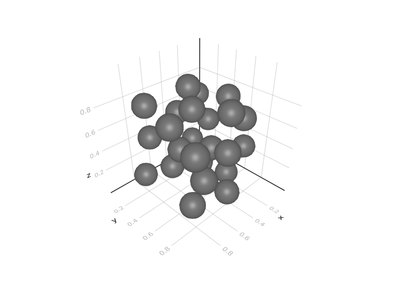

# InclusionsGenerator.jl
Random sphere generator

```julia
# domain size
lx, ly, lz = 1, 1, 1 

# volume fraction (%)
ϕ = 0.2 

# spheres radii
r = 0.1

inclusion_centers, vol_fraction = generate_inclusions(lx, ly, lz, ϕ, r)
```

